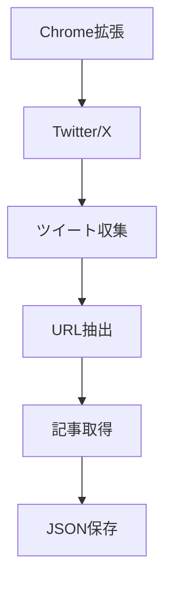

# AI News Collector - 自動化ガイド

## 概要

AI News Collectorの自動化機能を使用すると、Twitter収集、レポート生成、Neo4j保存を自動的に実行できます。

## 自動化の方法

### 1. Claudeコマンド（推奨）

最も簡単な方法は、Claudeコマンドを使用することです。

```bash
/collect-ai-news
```

このコマンドは以下を自動実行します:
1. 最新のツイートデータを確認
2. レポート生成
3. Neo4j保存（設定されている場合）
4. 結果サマリーの表示

### 2. スケジューラー

定期的な自動実行には、Pythonスケジューラーを使用します。

#### インストール

```bash
pip install schedule
```

#### 実行

```bash
# バックグラウンドで常時実行
npm run scheduler

# テストモード（即座に実行）
npm run scheduler:test
```

#### スケジュール設定

デフォルトのスケジュール:
- **毎週月曜日 09:00**: 週次レポート生成
- **毎日 10:00**: 新しいデータのチェック

`scripts/news_scheduler.py` を編集してカスタマイズ可能:

```python
# 毎週月曜日 09:00
schedule.every().monday.at("09:00").do(self.weekly_task)

# 毎日 10:00
schedule.every().day.at("10:00").do(self.daily_check)

# カスタム例: 毎週金曜日 15:00
schedule.every().friday.at("15:00").do(self.weekly_task)
```

### 3. システムタスク（Windows/Linux/Mac）

OSのタスクスケジューラーを使用して実行することもできます。

#### Windows タスクスケジューラー

1. タスクスケジューラーを開く
2. 新しいタスクを作成
3. トリガー: 毎週月曜日 09:00
4. アクション: `python scripts/news_scheduler.py --test`

#### Linux/Mac cron

```bash
# crontabを編集
crontab -e

# 毎週月曜日 09:00に実行
0 9 * * 1 cd /path/to/ai-news-collector && python scripts/news_scheduler.py --test
```

## 処理フロー詳細

### 1. データ収集



**手動ステップ**（自動化不可）:
1. Chrome拡張を開く
2. https://x.com/home にアクセス
3. 「Collect Tweets」をクリック

**自動化可能な部分**:
- URL先の記事取得
- データの整形と保存

### 2. レポート生成

```bash
python scripts/generate_report.py
```

**処理内容**:
1. 最新のツイートJSONを読み込み
2. AI関連トピックを抽出
3. Claude APIで分析（APIキーがある場合）
4. ナル先生スタイルでレポート作成
5. Markdown形式で保存

**出力**: `reports/ai_news_YYYYMMDD.md`

### 3. Neo4j保存

```bash
python scripts/save_to_neo4j.py
```

**処理内容**:
1. ツイートをTweetノードとして保存
2. 記事をArticleノードとして保存
3. ユーザーをUserノードとして保存
4. トピックをTopicノードとして保存
5. 関係性を作成:
   - User -[:POSTED]-> Tweet
   - Tweet -[:LINKS_TO]-> Article
   - Tweet -[:MENTIONS]-> Topic

**グラフ構造**:

```
(User) -[:POSTED]-> (Tweet) -[:LINKS_TO]-> (Article)
                       |
                       +-[:MENTIONS]-> (Topic)
```

## 環境設定

### 必須

```bash
# Python依存パッケージ
pip install -r requirements.txt
```

### オプション（推奨）

```bash
# Anthropic API（高品質なレポート生成）
export ANTHROPIC_API_KEY='your-api-key'

# Neo4j（グラフDB保存）
export NEO4J_URI='bolt://localhost:7687'
export NEO4J_USER='neo4j'
export NEO4J_PASSWORD='your-password'
```

`.env`ファイルを作成:

```bash
ANTHROPIC_API_KEY=your-api-key
NEO4J_URI=bolt://localhost:7687
NEO4J_USER=neo4j
NEO4J_PASSWORD=your-password
```

## トラブルシューティング

### データが古い

**症状**: スケジューラーが「No fresh data」と報告

**解決策**:
1. Chrome拡張で新しいツイートを収集
2. または、古いデータでもレポートを生成:
   ```bash
   python scripts/generate_report.py data/tweets/old_file.json
   ```

### Neo4j接続エラー

**症状**: `Error connecting to Neo4j`

**確認項目**:
1. Neo4jが起動しているか
   ```bash
   curl http://localhost:7474
   ```

2. 環境変数が正しいか
   ```bash
   echo $NEO4J_URI
   echo $NEO4J_USER
   ```

3. 認証情報が正しいか
   - デフォルトユーザー: `neo4j`
   - 初回パスワード変更が必要

### スケジューラーが動かない

**症状**: タスクが実行されない

**確認項目**:
1. スケジューラーが起動しているか
   ```bash
   ps aux | grep news_scheduler
   ```

2. ログを確認
   - コンソール出力を確認
   - エラーメッセージをチェック

3. テストモードで実行
   ```bash
   npm run scheduler:test
   ```

## ベストプラクティス

### 1. 定期的なバックアップ

```bash
# データディレクトリをバックアップ
cp -r data/tweets data/tweets_backup_$(date +%Y%m%d)

# Neo4jデータをエクスポート
cypher-shell "CALL apoc.export.json.all('backup.json', {})"
```

### 2. ログ管理

スケジューラーの出力をファイルに保存:

```bash
python scripts/news_scheduler.py > scheduler.log 2>&1 &
```

### 3. 通知設定

`news_scheduler.py` の `send_notification()` をカスタマイズ:

```python
def send_notification(self, message):
    # Email通知
    import smtplib
    # ... メール送信コード

    # Slack通知
    import requests
    requests.post(SLACK_WEBHOOK, json={'text': message})
```

## まとめ

- **手動収集**: Chrome拡張でツイート収集（自動化不可）
- **自動処理**: レポート生成とNeo4j保存
- **スケジュール**: 毎週月曜日の定期実行
- **Claudeコマンド**: `/collect-ai-news` で統合実行

完全自動化のワークフロー:
1. 月曜日: スケジューラーがデータチェック
2. データがない: 通知を送信
3. ユーザー: Chrome拡張でツイート収集
4. スケジューラー: 自動でレポート生成とNeo4j保存
5. 完了通知
